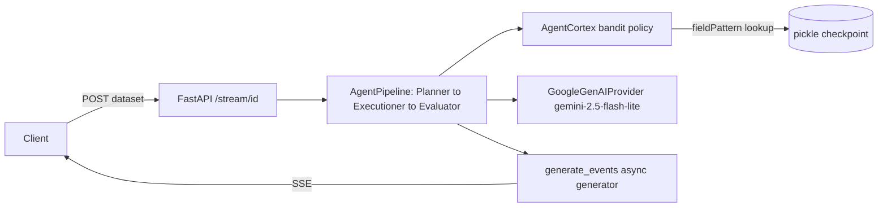

# databy-cortex

*(recommended rename of `databy-sse` — the repo trials a decision "brain," not a transport protocol)*

[](#)
[](https://python.org)
[](https://fastapi.tiangolo.com/)

An early decision-engine sandbox for **Gaby**, my self-directed data-cleaning agent: it trials a reward-driven bandit policy for picking a cleaning action without a hand-written prompt, wrapped in a composable, self-registering agent pipeline and streamed live over Server-Sent Events.

## Highlights

- **Objective**: prove that a data-cleaning agent can select its next action from experience — a dataset's shape — rather than from a scripted or user-written prompt, and stream that reasoning to a client in real time.
- **Key Feature**:
  - `AgentCortex` — a bandit-style policy that fingerprints a dataframe's dtype composition into a compact `fieldPattern` key, then reuses the best known action for that pattern or explores uniformly at random; checkpoints persist via pickle.
  - `PageRanker` — a PageRank implementation (column-stochastic matrix, power iteration, dangling-node handling) trialed as a way to rank candidate fields/actions by importance.
  - `AgentPipeline` / `AgentBasement` — nested classes auto-register as ordered pipeline stages via `__init_subclass__`, giving a declarative `Planner → Executioner → Evaluator` chain.
  - A FastAPI `/stream/{id}` endpoint that pushes each pipeline stage's state as an SSE event.
- **Tech stack**: FastAPI + Uvicorn, Google GenAI SDK (`gemini-2.5-flash-lite`) via a custom provider wrapper, pandas/NumPy for profiling and the PageRank linear algebra, Docker (Cloud Run target), Jupyter-backed "agent playground" kernels (local, Kaggle, EC2/Codespace) for sandboxed code execution.
- **Evaluation**: `pytest` + `httpx.AsyncClient`/`ASGITransport` exercise the SSE endpoint in-process; pipeline stages are mock-tested against a synthetic dirty "café sales" dataset with the Gemini client stubbed via `unittest.mock`; `PageRanker` convergence is validated in `scratchpad_algos.ipynb` against hand-built adjacency matrices (identity, hub-and-spoke, chain, cycle, disconnected, dangling-node, sparse-random).
- **Results & Conclusion**:
  - The nested-class, self-registering pipeline pattern is a clean way to compose multi-stage agents and carried forward into the later `databy-socket` sandbox.
  - The dtype-fingerprint bandit is a workable seed for promptless action selection, but its flat, pickle-persisted policy doesn't yet scale past a handful of field patterns or survive restarts cleanly.
  - Next: fold the bandit into a proper chain-of-responsibility pipeline with a durable reward store, rather than a standalone policy object.

## Project Directory Overview

```text
databy-sse/
├── app/
│   ├── main.py                 # FastAPI app + /stream/{id} SSE endpoint
│   ├── config/                 # dev/prod pipeline.yml
│   ├── src/
│   │   ├── agent/
│   │   │   ├── base.py         # AgentBasement, AgentPipeline, AgentDataset, AgentRLBuilder
│   │   │   ├── chains.py       # SkeletonAgentPipeline (Planner/Executioner/Evaluator)
│   │   │   ├── hostess.py      # GoogleGenAIProvider (Gemini wrapper)
│   │   │   └── rl.py           # AgentCortex (bandit policy), PageRanker
│   │   ├── playground/         # Jupyter/Kaggle kernel controllers (agent code sandbox)
│   │   ├── router/             # SessionInput/EventOutput pydantic schemas
│   │   └── streamer.py         # generate_events() async SSE generator
│   ├── static/, utils/         # logging, paths, startup
├── docs/                       # GitHub Pages / Jekyll site
├── tests/                      # pytest suite (SSE, loader, startup, playground)
├── scratchpad*.ipynb           # algorithm and pipeline trial notebooks
├── requirements.txt
└── Dockerfile
```

## System Architecture



Every pipeline stage shares one execution contract (`AgentBasement.__call__`): `preprocess → format prompt → call LLM → postprocess → StateMessage`. `AgentPipeline` builds its stage order by scanning its own class body for nested `AgentBasement`/`AgentPipeline` subclasses, so a new pipeline is just a new set of nested classes — no manual wiring. `AgentCortex` sits beside this chain as the "which action next" decision point, keyed off each dataset's dtype fingerprint rather than a prompt.

## Dev Notes

- **Requirements**
  - Python 3.11
  - A Google GenAI API key (`GOOGLE_API_KEY`) for the Gemini provider

- **Installation**:

    ```bash
    # Clone the repository
    git clone https://github.com/whoamimi/databy-sse.git
    cd databy-sse

    # Create and activate environment
    conda create -n databy-cortex python=3.11 -y
    conda activate databy-cortex

    # Install dependencies
    pip install -r requirements.txt
    ```

- **To start**:

    ```bash
    python -m app.main
    # or, for autoreload during development
    uvicorn app.main:app --reload
    ```

- **Test**:

    ```bash
    python -m unittest discover
    # or
    pytest
    ```

## Citation

If you build on this sandbox as part of the Gaby project, cite it as:

```bibtex
@software{mimi2026databycortex,
  author = {Mimi},
  title  = {databy-cortex: a promptless action-selection sandbox for the Gaby data-cleaning agent},
  year   = {2026},
  url    = {https://github.com/whoamimi/databy-sse}
}
```
