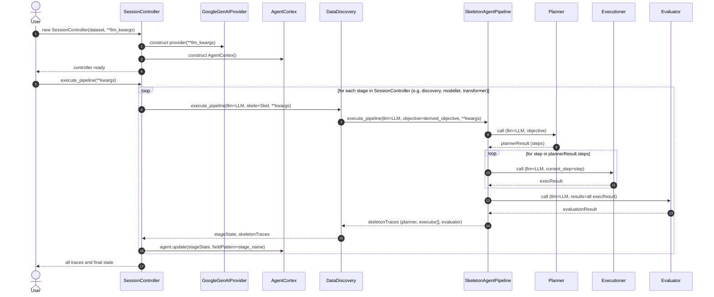

---

title: AI Agent Architecture
nav_order: 1
description: AI/ML Dev Notes

---

- **Content**
{:toc}

Despite the hyped nature of 'AI Agent' usage in this generation and the pressure that it brings, it extends the current programming paradigm and to current programmers. Whilst building the fundamental or skeletal codebase for my bots, it prompted me to reconsider many designs specific to the following areas:

- Data system Architectures. The idea that I am not limited to modelling or drafting the format of how these dataset is collected or stored - like in most day-to-day jobs of a data worker, brought me alot of joy.
- Importance of Logging and traces. In other words, measuring the intensity of my abuse on using decorative functions and classes. There is a fine line between sufficient and over-engineer and unfortunately, I often find myself in the latter more than I intend to.

# **How the module works**

## **Building an Agent**

All AI Agents are built by inheriting `AgentBasement` Object class.

## **Pipelines**

All Pipelines and workflows are built by inheriting `AgentPipeline` which inherits `OrderedDict`. The inheritance between 

# **From User Event Driven Point-of-view**

The workflow is as follows:

