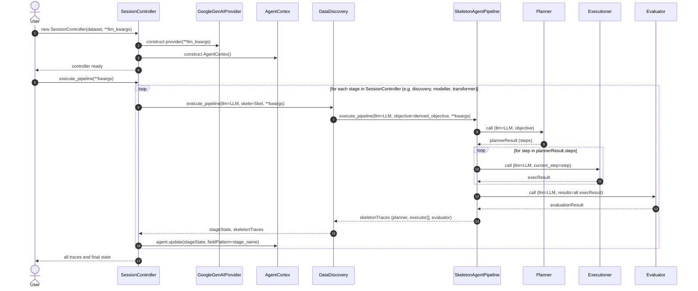

---

title: AI Agent Architecture
nav_order: 2
description: AI/ML Dev Notes
collections:

---

- **Content**
{:toc}

Despite the hype surrounding “AI agents” and the pressure that accompanies the trend, they meaningfully extend the contemporary programming paradigm and, in doing so, expand what working programmers can reasonably build. While constructing the foundational—almost skeletal—codebase for my bots, I found myself reconsidering several design choices, especially in the following areas:

- Data system architecture. The realization that I’m not confined to the typical constraints of day-to-day data work—merely modeling or drafting how datasets are collected and stored—has been genuinely invigorating.
- The importance of logging and tracing. Put differently, they force me to quantify how far I push “decorative” functions and classes. There’s a fine line between adequate structure and over-engineering—and, more often than I’d like, I end up on the wrong side of it.

# **From User Event Driven Point-of-view**

The workflow is as follows:

